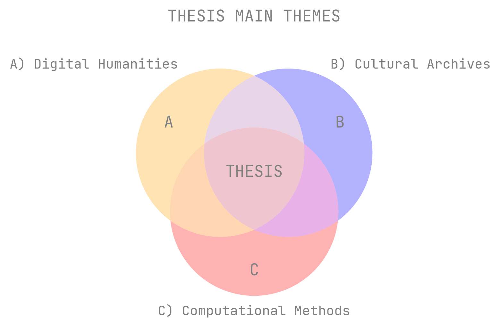
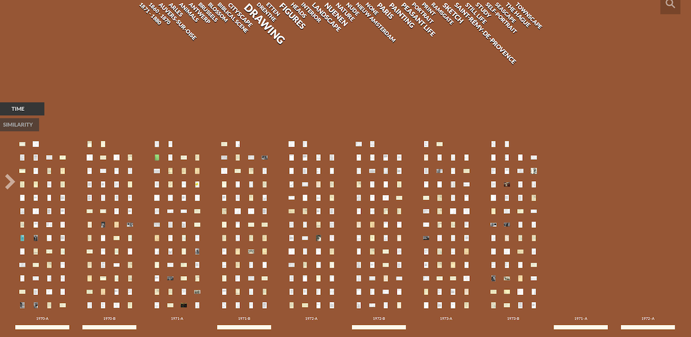
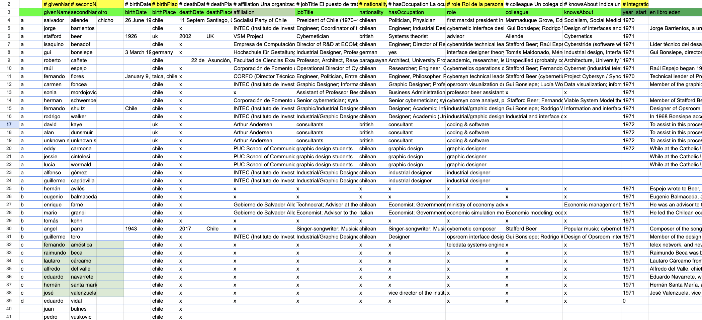
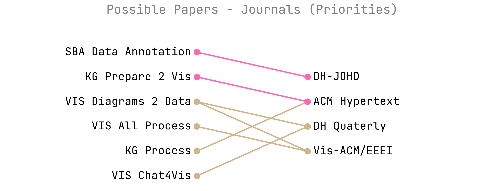

# Meeting Notes.  

## FUTURE.   

**John - August ? 2026, xx:xx - xxxxxx**.   
to be confirmed.  

**Uta - August ? 2026, xx:xx - xxxxxx**.   
to be confirmed.  

   

## CURRENT.   

**Melissa & John – August 10, 2026, 12:00 – in-person**  

  

**A– TASKS**  

– Introduction (sent Monday the 3rd): I will integrate the texts following this review.  
– CSV File Data: requires more iterations and cross-checking against Ground Truth.  
– Aug-Dec Plan: Focus on KG/VIS/LLM2Vis. Prepare processes for integration between January and April 2027.  
– Ethics application submitted (correction on August 4th): response expected in 10 days.  

   

**B– UPDATES**  

  

– Vikus Viewer: local basic implementation, first step (Tomas providing hands-on help).  

  

– Initial Ground Truth: people, institutions, etc.; to be expanded.  
– Workshop / Surveys: proposals in progress.  
– Transkribus grants (1000 credits).  
– Accepted 100ySB Conference (Sept 17th-19th, Manchester):  
... Presentation: Visualisation Process.  
... Possible article in SB book (2027). meeting with Ben Wood, 27 August.  
... Possible workshop with experts (to be discussed).  
– Accepted Hypertext (Sept, 12, 16, London):  
... SummerSchool Poster accepted, Travel Grant, Meetings every 2 weeks.  
... KG workshop: Preparing short paper proposal (preparing data for KG).  

   

**C– QUESTIONS/DISCUSSION**  

  

– Possible article in August-September (questions made to Barbara McGillivray) for the [Journal of Open Humanities Data](https://openhumanitiesdata.metajnl.com/) (paid, Funding?).  
– Review previous text: what needs improvement? I need some advice on this.  
– Discuss workshop + interviews to gather more user information (Uta, John).  
– Possible articles: Diagram.  
– Focus of the project: Digital Humanities or Visualisation for Digital Humanities?  
– KG hypertext: preparing KG for visualisation?  
– Project Three lines o

**D– TO COMMENT**

- Dr.'s document: A is better, but A needs continuous observation to change the m. Please note: I haven't come to Informatics, 3 weeks at home with my family.
- Meeting with PUC, Chile (Friday 7): good reception, they knew my situation in Chile. It is possible to have a 6-month extension for thesis writing (a new course in many cases). Is extension an issue for UofEd?
- 1st Semester 2027: complete integration and thesis work (Chile).
- Budgetary restrictions in Chile, I will need to find new resources.

 

**E– NEXT STEPS**

- Resume literature review: strengthen DH, KG4Vis, LLM4Vis, Chat4Viz, HD data sections.
- KG: implement entities and relationships, etc.
- RAG local data (Qwen, Claude, etc.?).
- LJMU visit (September/October): archive status, research interests, researcher expertise.
- Workshop & Interview in progress (UofEd authorisation process).
- VisHub presentation and SBA workshop.
- Begin prototype implementation.
- Refactor code: make it organised and clearer (structure, comments, variables, generalisation).
- Integrate and revise submitted thesis texts into a single document.
- Table of contents and topic structure to be defined.
- Photographs: descriptive texts using LLMs (Gemini, GPT-4o Mini; will test Qwen 2.5-VL / Qwen 3.5 via ELM).
- Auto-ethnography integrating process writing notes, diagrams and prototyping visualisations.
- Incorporate tags, labels, and other elements (from ground truth and others).

 

**F– REFERENCES**

- About Vikus project: [github.com/cpietsch/vikus-viewer](https://github.com/cpietsch/vikus-viewer)

  
## PAST.   

  
**John – July 16, 2026, 15:00-15:30 (to be confirmed) – in-person**.   

John's office – IF 4.32.  
–Tomas Vancisin meeting: great advice!
–Transkribus answer: credits ok (tuestday). 
–Questions iteration 2.  
–Abstract & tits.   
–Index in detail for Introduction.   
–Preparation for 10 august meeting.   
–X– Paper for Knowledge Graphs and Hypertext - Interaction with Rich Knowledge Structures
which idea is better? 

   
**John – July 8, 2026, 16:00 – in-person**.  
John's office – IF 4.32.  
+Comments on the summer schools: Comp Interact, Nime, DHRSE.  
+Regarding the last meeting (planning, data, etc.): show notes and tasks, see if ok.  
+Thesis progress: classification, resize, visualisations (exploratory).  
+Prototyping visualisations: explorer.  
+Index: Initial thesis table of contents: to prepare introduction.  
+Research Questions:  
+Abstract.  
+Plan: how much detail? goal...  

–Research: survey/workshop in preparation, thinking goal/dates (ethics authorisation).  
–Report Github: reports, texts, index, plan, etc. (improve + GDrive).  

Questions:  
–Extending the time for the thesis in Chile. Do I need to do so here, too?  
–Ask for a medical document about Alicia (impact on my time and mood).  
–Next meeting next week...? (planning for the August meeting).  
–100 Years of Stafford Beer, Manchester. 17th–19th September: present some progress.  

Meeting Notes:  
–Working on the main question based on the previous, but focused on DH & Vis challenges.  
–Secondary questions related to each challenge: KG creation, Chat responses, Vis creation.  
–Develop prototypes to test each challenge.  

   
**John & Melissa – June 24, 2026, 16:00 – online**  
–Comments to the previous text.  
–Two texts reviewed:  
RV_a_About_SBArchive_24jun_2026.pdf. 
RV_a_About_SBeer_and_Cybersyn_24jun_2026.pdf. 
–Defining next texts: Proposing an introduction, which will help me articulate the project.  
–Steps, July: extracting information, start KG prototype.  
–Intro to initial paper?  
–Define focus and questions. 
–Others. 

NEXT MEETING:  
–Discuss workshop + interviews with UTA to get more info on users.  
–I will apply for:  
INTR/HT Summer School, 12–13 Sept (London, selected!).  
100 Years of Stafford Beer. 17–19 Sept (Manchester).  
Transkribus Scholarships: [https://www.transkribus.org/scholarship](https://www.transkribus.org/scholarship) (done!). 

Meeting Notes:  
–Research on "case study". Writing about the relevance of this case study. See other ones.  
–Info extraction on archival material, value of information extraction. Methods of case study: why is it appropriate?  
–Problem, methods, and gaps in machine processing text.  
–Write like a research paper more than a report, create arguments.  
–Key question: visualisation of cultural archive. Certain types of material.  
–Develop a high-level question, grounded in more specific issues.  
–How might LLMs and GenAI be incorporated into a vis workflow-pipeline for cultural archives? Sub-questions of the two parts or challenges.  
–Thinking about who it is for will help to think about the question. Why am I doing this? Make a choice based on interest in visualisation.  
–For workshop & surveys, consider ethics approval by Informatics, which takes little time (3 weeks).  
–Reports of the events related to the project?  
–Research workshop and interviews. Why is it important for research questions?  
–Methodology not yet, first approach to the research.  
–Working on the document structure with John.  
–Check the thesis from Edinburgh from Design Informatics (research explorer) to see the structure.  
–Review Provenance Visualisation with the idea of a case study (check Tomas's Thesis). Rethinking historical university records: provenance in visualisation and digital humanities research.  
[https://research-repository.st-andrews.ac.uk/handle/10023/29239](https://research-repository.st-andrews.ac.uk/handle/10023/29239).  

In August:  
–All the documents transcribed, all data clear.  
–A plan to work: 6 months to do all the things.   
–See ethics (first see dates for the activities).  
–Next meeting August 10.  
–Meeting with John before August 16 (he is leaving).  
–Next text in Word (no PDF). Implement Google Docs to share documents. 1 document with all the texts.  

**+ + + + + + + + + + + + + + + + + + + + + + + + +**    
**–  –  –  –  – P  A  S  T –  –  –  –  –**   
**+ + + + + + + + + + + + + + + + + + + + + + + + +**    

**Uta week 8th- june ? 2026, 16:00 - online**.  
Questions:   
–What path to follow in the research.  
–Intrerviews, preparint workshop.   
–Presentation June 30 pospsoed, I was selected to summer school.  
–I cannot do wshop in june.  
–Review interview questions + wshop material.  
–Recommended jpurnal to write, wich line: representation method, ai4vis.  

**John - week 8 no - june 15/16/17 2026, 16:00 - online**.  
–Thesis title, initial index (i do refer structure of content, not thesis).   
–Discussing questions - abstract/description.  
–Paper ideas.  
–Text review: SBeer, Archives Description, Cybersyn (topics covered are ok?).  
–Revision online.  
–Thesis title & initial index.   
–discussing the abstract/description (w John/Melissa).  
–Authorization to attend:  
Hypertext: 12 sept-(16) 18, London.  
100 Years SBeer Conferece: 17-19 sept, Manchester.  
–I need your authorization to apply for a job:  
–Prepating a online report for John & Mellisa (github?).  
–Next meeting online.   

**John Melissa - june 4 2026, 16:00 - online**.  
–I sent the material late, it's my mistake. Professor Melissa asked me for a letter of commitment, sent Monday the 8th at 6:30 am   

Dear Professors Terras and Vines:
As discussed in our last meeting, I am sending you the core commitments I am making to develop my doctoral research and writing skills:   
–Participate in scheduled meetings once a month.   
–Write between 500 and 1,000 words daily to practice academic writing.  
–Submit requested texts at least 5 days in advance for review.  
–Improve my English proficiency.  
Thank you.  
Best regards, Ricardo Vega  

**John - may 01 2026, ??:00 - John Office**.  
–thesis title & initial index.    
–Legal issues:   
–p6.2: UoE would anticipate that a period of at least 18 months was spent at Edinburgh, this being 50% of the normal duration of the research phase of the normal Edinburgh programme. The minimum period is 12 months.  
I arrived march 14, leave feb 28.   
–Check: 7. Examination process and requirements. The thesis is then presented to the Dissertation Committee, which is composed of the dissertation advisor, programme director or delegate who is the chair, two internal examiners (professors), an external examiner who must be external to both universities, and an international examiner. The internal and external examiners will be appointed in consultation with the Partner University.   

**Uta may 27 2026, 12:30 - EFI VISHUB**.  
–Showing possible questions/ideas for interview/workshop   
–Question sheet, models, web references.  
–excel conceptual models (possible paper?)   
–Recommend journals and conferences. https://2027.computational-humanities-research.org/cfp/
Questions:   
–what path to follow in the research.   
–Preparing Intrerviews & workshop.  
–Next week no meeting w UTA.   

**Tomas Vancisin - mon 25 20206, 13:30?**. 
—main experience, problems, focus.  
–if I need some advice of the process.  
–What are the main questions he developed.  
–Do you work with AI?     
–can answer some questions?     
–Do you developed some user research?     
–How it was the response to the vosualization.   
–Result: A very interesting meeting. He showed me his projects on provenance visualization and reinforced the idea that to explain the project and its process, it might be interesting to prototype the entire process using visualizations, which is a great challenge. This meeting helped me critique how to incorporate my interest in the visualization process into the project and how to articulate it. He also invited me to work at the Beach office and participate in the vushub meetings.
A very good meeting with Thomas. He suggested that documentation is important and should be used as part of the visualization. Using visualizations to document and explain the process would give meaning to the work, autonomy, and understanding of the process. A very good meeting.   

**John may mon 25 20206, 14:30?**.  
A:   
–Meeting w Tomas Vancisin.  
–Reu c Juan thusrday: What to talk with: advancements, coordination, kind of thesis.   
–Coordination of Annual review presentation. formallrequirements. 2 tesis o una para uk o chile. 12 months. ed december or march.   
–More focused in the visualizacion stage, doc to data just in general terms.   
B:  
–Preparing meeting w Melissa. 
–1rs tracks/paper ideas/focus: 3 output options: methodological (visualization models); engineering (technical process); mix.   
possible PhD path: 3 papers or Thesis? (UC publication, one accepted in journal.   
–Uta: some reseach like workshop/interiews with stake holders: what they wanto to see...  
–Strategy for thesis: preparing thematic index can be a good starting point?   

Results:   
–John agrees with starting the index as a way to works inde the whole picture of the project.  
–Make comments on the thesis, just the formal chilea nthesis.   
 
John next meeting:   
–Thesis initial index.  
–Thesis title, questions.   
–Discussing the abstract/description (w John/Melissa).  

**uta may 21 20206, 12:30**
–I Talked w John, OK, with autoethnography (CL?).  
–Show thesis project.  
–Autoethnography form.   
–Show the process stages, what can be added or considered.   
–Do research on process models with other people?   
–How to define the user.   
–Topic of the talk on June 30th, my thesis, Cybersyn? Another one? Duration, etc.   
–Provenance, process.  https://dl.acm.org/doi/10.1145/2317956.2318034  

Vancisin, T., Clarke, L., Orr, M., & Hinrichs, U. (2025). Provenance Visualization as an Entry Point to the History and Curation of Information Collections. Journal of Visualization and Interaction. 1, 1 (Apr. 2025). DOI:https://doi.org/10.54337/jovi.v1i1.8436. Press

Vancisin, T., Orr, M., & Hinrichs, U. (2020, October). Externalizing Transformations of Historical Documents: Opportunities for Provenance-Driven Visualiz… In 2020 IEEE 5th Workshop on Visualization for the Digital Humanities (VIS4DH) (pp. 36-42). IEEE.
	
VisHub meetings Tuesdays, 2-3pm
At the Edinburgh Futures Institute

Output:   
–She gave the sugesiton to incorporate autoetnography for sistematic dumentation and a continous prototyping to explore possibilities of representation.    
–Question: there are auto etnograohy in engineering?     
–Validating process, indeiftifying key people to present the project. ej. a workshop to explore the process.    
–Previous material to explore. users. flaneur, experts, etc. 

UTA: next sesion.   
–showing questions.   
–showing possible quesiotns for interview/workshop ideas.  
–preparar pcosas preswentar en persona: ficha, modelos, referentes web.  
–mostrar excel modelos u hacer paper.  
–Recommend journals and conferences.  https://2027.computational-humanities-research.org/cfp/  

**John may 18 2026, 14:00**.  

Ver q cosas llevar.  
a–Conversation with UTA, consoidering visualization as part of the process:   
b–Incorporate autoethnography (see worksheet of the process).  
c–Presentation for Wednesday: my project or cybersyn? cybes and at the ends how my poroject works this topic.   
d–Explain my situation with Alicia. ke he understodd all.    
e–Have you spoken with Juan?. what they neet to talk.   
f–Resume weekly meetings.   
g–If you'd like, I can come with guidelines.  
h–Conference funding. 

i–Work w Teachers, dp you agree?: 
John; AI & LLM tools.
Melissa: extractin knowledge and DH questions.
Uta: interface, visualizaiton. 

j–Three project outputs: methodological (visualization models); engineering (technical process); mix.
k–Two working phases:
a) doc to ddbb
x) Cultural analitics?
b) ddbb to vis. 

RESULTS:
ver autoetnografia y ver prouesta de ficha. 
ordenar archivos referencias, ordenar desarrollos de ideas 
presentación: sobre cybesyn, hd, conceotos biologicos, my poryecto como encaja.
juan, administratios, ver cuando presento como es l actividad de segui iento, pedir reu para comentar mi avance.  

**uta may 18 20206, 14:00**
First meeting, very productive, great insights. 

**Melissa may 18 20206, 14:00**
First meeting, very clear, great insights. 

